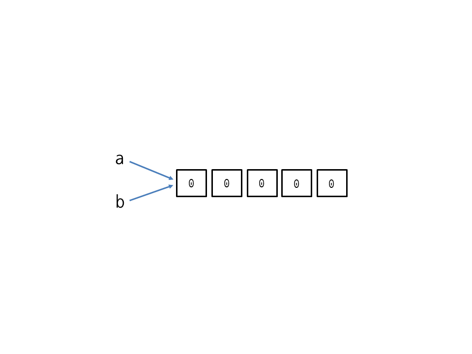

# List와 Tuple

## append가 무엇인가 => 리스트의 맨 뒤에 요소를 추가하는 방식

```python
a = [1,2,3]
a.append(50)
print(a)
print(len(a))
[1,2,3,50]
4
```

## extend가 무엇인가 => 리스트를 연결해서 확장
```python
a = [1,2,3]
a.extend([50])
print(a)
print(len(a))
[1,2,3,50]
4
```

## 그러면 두 개가 다른 것이 무엇인가요!?

```python
a = [1,2,3]
a.append([1,2])
print(a)

## [1,2,3,[1,2]]
```
```python
a = [1,2,3]
a.extend([1,2])
print(a)

## [1,2,3,1,2]
```

## 다양한 list 메서드를 찾아봅시다!
list를 한번 타고 들어가보져 여러분!

## 리스트의 할당과 복사



```python
a = 1 # 상수를 가지고 놀 때에는 값이 변하지 않는다.
b = a
b = 10

print(a)
print(b)

## 1
## 10
```

```python
a = [1,2,3]
b = a 
b[0] = 10
print(a)

## [10, 2, 3]


만약 완전히 독립된 객체로 가지고 싶다면 copy() 함수를 이용하자
```


## 리스트 요소 출력하기

```python
a = [1,2,3,4,5]
for i in a:
    print(i)

## 1
## 2
## 3
## 4
## 5
```

## 만약 요소와 인덱스를 같이 출력하고 싶다면? enumerate 여기서 조심해야 할 것은 index와 value의 위치를 헷갈리지 않아야한다!

```python
a = [10,20,30,40,50]
for index, value in enumerate(a):
    print(index,value)

## 0 10
## 1 20
## 2 30
## 3 40
## 4 50
```


## 시작 인덱스를 지정해주고 싶다면?
```python
a = [10,20,30,40,50]
for index, value in enumearte(a, 1)
    print(index, value)

## 1 10
## 2 20
## 3 30
## 4 40
## 5 50
```


# 중요 중요!! 리스트 표현식 => List Comprehension
```python
a = []
for i in range(10):
    if i % 2 == 0:
        a.append(i)

# [0,2,4,6,8]
```
같은 답 
```python
a = [i for i in range(10) if i % 2 == 0]

# [0,2,4,6,8]
```

### 그러면 여러분 아래 코드를 한번 다들 타이핑해서 실행해볼까요? 출력되는 값을 확인하고 어떻게 작동하는지 얘기나눠요
```python
 a = [i if i % 2 == 0 else i * 10 for i in range(10)]
print(a)
```


## Map 함수를 list에 사용
여러분 저희 map함수는 보통 input에서 많이 사용했던거 기억나실거에요
그런데 이번에는 input이 아닌 list에서 사용하는 법을 익혀보아요

```python
a = list(map(str, range(10)))
print(a)

## ['0', '1', '2', '3', '4', '5', '6', '7', '8', '9']
```

그리고 이전에 알려드렸던 대로 map 함수를 입력해서 한번 어떤 인자를 받는지 살펴보도록 합시다!

첫 번째 인자로는 func <- 함수를 받는거 보이시나요! 그러면 한번 range(10)의 범위에서 모든 요소에 대해 *2씩 되는 list를 작성해볼까요?

```python
def gob2(x: int) -> int:
    return x * 2

a2 = list(map(gob2, range(10)))

## [0, 2, 4, 6, 8, 10, 12, 14, 16, 18]
```
여기서 또 주의하셔야 할 점 gob2는 실행시키시면 클나요~ 뻑남 ㅎㅎ

## 2차원 배열 주의해야할 점
```python
"""
2차원 이상의 배열에서는 copy가 아닌 deepcopy를 이용해야한다
"""
# why?
a = [10, 20] 
b = a

id(a) == id(b) # True

a = [10, 20]
b = a.copy()

a is b # False
id(a) == id(b) # False

# 전 시간에 했던 id 명령을 통해 확인 할 수 있음
```

2차원 배열에서의 문제점
```python
a = [[10,20], [30,40]]
b = a.copy()

a is b # False 여기서는 copy명령이 잘 들어갔다

id(a[0][0]) # same
id(b[0][0]) # same
```
이차원 배열의 경우 그냥 copy를 쓰는 경우 내부의 리스트까지 평행선을 달리도록 하지 못하기 때문에 주의해야한다!

2차원 배열은 세로 => 가로 순


# Dict


## 딕셔너리에 키 값 쌍 추가 및 기본 값을 저장하기

setdefault로 값을 None으로 설정한다. 여기서 사용할 떄 주의하셔야 할 점!
- setdefault는 이미 들어있는 키의 값을 수정할 수는 없습니다! 주의!
```python
x = {'a': 10, 'b': 20, 'c': 30, 'd': 40}
x.setdefault('e')
print(x)

# {'a': 10, 'b': 20, 'c': 30, 'd': 40, 'e': None}

## OR ## 

x = {'a': 10, 'b': 20, 'c':30, 'd': 40}
x['e'] = None
print(x)

# {'a': 10, 'b': 20, 'c': 30, 'd': 40, 'e': None}
```

Update로 값을 변경해보시져!
```python
x = {'a': 10, 'b': 20, 'c': 30, 'd': 40}
x.update(d = 50)
print(x)

#{'a': 10, 'b':20, 'c': 30, 'd': 50}

## OR ##

x = {'a': 10, 'b': 20, 'c': 30, 'd': 40}
x['d'] = 50
print(x)
```


## Pop과 del의 차이?

우선 pop의 경우 dict에서 해당 값을 삭제하며 값을 반환한다!!
```python
x = {'a': 1, 'b': 2}
x.pop('a') # 1 여기서 1이 반환됨
print(x)

# {'b': 2}

## OR ##

x = {'a':1, 'b': 2}
del x['a']
print(x)

# {'b': 2}
```

## get

```python
x = {'a': 1, 'b': 2}
x.get('a') 
# 1

## OR ## 

x = {'a': 1, 'b': 2}
x['a']
# 1
```
popitems의 경우에는 마지막 키-값 쌍을 삭제해요~!
다만 파이썬 3.5 아래서는 랜덤 삭제니 주의하시오

### 딕셔너리에서 키-값 쌍 가져오기!
```python
x = {'a': 10, 'b': 20}
x.items() # 키 - 값 쌍을 가져옵니다!
x.keys() # 키 값을 가져옵니다!
x.values() # 밸류 값을 가져옵니다!
```


## Set
세트는 {} 중괄호 하나로 만들 수 있는데 주의해야할 점으로는 인덱스를 제공하지 않는다! 즉 특정 값을 하나만 가지고 올 수 없다.

세트의 교집합 & (and)=> 교차하는 부분만 가져온다.
```python
a = {1,2,3,4,5}
b = {3,4,6,7}
a & b

## {3,4} # a와 b의 교집합!
``` 

```python
a = {1,2,3,4,5}
b = {3,4,6,7}
a - b

## {1,2,5} # a와 b의 겹치는 원소를 제외한 a!
```

```python
a = {1,2,5,6}
b = {3,4,5,6}

a ^ b

## {1,2,3,4} 겹치는 부분을 빼고 나머지!
```

부분 집합과 상위집합! 저도 공부할때 빼고 사용 안해봤어요!

```python
a = {1,2,3,4}
a.issubset({1,2,3})
# False
```

## 세트 조작

삭제와 관련해서!? pop의 경우에 임의의 요소를 삭제한다
```python
a = {1,2,3,4,5}
a.pop()
```

세트 역시 리스트와 같이 완전 독립된 개체로 사용하고 싶다면 copy() 메서드를 사용하면 됩니다!
```python
a = {1,2,3,4,5}
b = a.copy()

id(a) == id(b)
```

for문 출력? => 순서가 없기 때문에 출력 때마다 값이 바뀌는 것 조심! 또한 주의해야할 점! 세트는 중복되는 값을 한 개만 남기기 때문에 p가 중복되는 경우 한 개만 출력됩니다~
```python
a = 'apple'
b = {word for word in a}
print(b)
```


## 파일 읽기 쓰기
```python
file = open('hello.txt', 'w') # 읽기의 경우 'r'
file.write('Hello, python')
file.close()
```

## 회문 판별
```python
word = 'level'

is_palindrome = True
for i in range(len(word) // 2):
    if word[i] != word[-1 -i]:
        is_pailndrome = False
        break

## OR ## 거꾸로 인덱스

word = 'level'
print(word == word[::-1])

## OR ## reversed를 이용해서 하기

word = 'level'
list_word = list(word)
re_word = list(reversed(word))

print(list_word == re_word)
```


## def 함수!!

여러분 드디어 함수에 도달했습니다
```python
def add_cal(a, b):
    """
    두 개의 인자를 더하는 함수입니다.
    """
    return a + b

add_cal(1,2)
```

### 가변인자 
인자의 갯수를 특정할 수 없을 때 많이 사용! 리스트 언팩킹과 비교하면서 주의하자

```python
def p_num(*nums):
    for num in nums:
        print(num)

p_num(1,2,3,4,5)

## OR ##

def n_num(a, b, c):
    print(a)
    print(b)
    print(c)

n_num(*[1,2,3])
```


kwargs 키워드 인자!는 딕셔너리로 값이 들어온다 생각하면 편해용
```python
def sol(**kwargs):
    new = {}
    for key, value in kwargs.items():
        new['key'] = value
    return new

print(sol(name = 'jinwoo', age = 20))

## OR ##

def sol(**kwargs):
    new = {key: value for key, value in kwargs.items()}
    return new

print(sol(name = 'jinwoo', age = 20))
```


인자의 초깃값 설정
```python
def sol(name, age, address='비공개'):
    print('이름', name)
    print('주소', address)
    print('나이', age)

sol('jinwoo', 1)

# 이름 jinwoo 주소 비공개 나이 1
```

### 재귀함수

재귀함수 => 자기 자신을 호출하는 함수
```python
def factorial(n):
    if n == 1:
        return 1
    return n * factorial(n-1)

print(factorial(5))
```